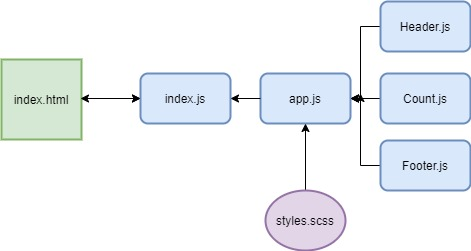

# LAB - Class 21

## "Hello World" React

### Author: Madison Stehle

### Links and Resources

- [submission PR](https://github.com/madisonstehle/hello-world-react/pull/1)
- [app code in codesandbox](https://codesandbox.io/s/hello-world-react-2uy79?file=/src/App.js)
- [front-end application](https://2uy79.csb.app/)

### Setup

#### How to initialize/run the application

- If using on a local machine, `npm start` will start the app on localhost.
- Otherwise, the link above to the front-end application will take you to the site.

#### Tests

Not Applicable for this lab.

#### UML

